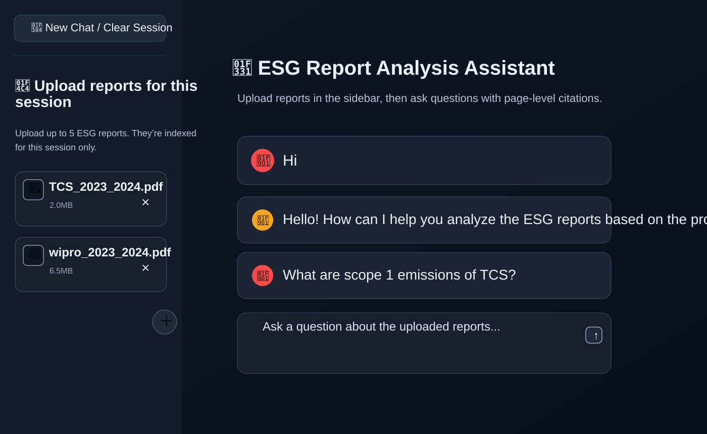
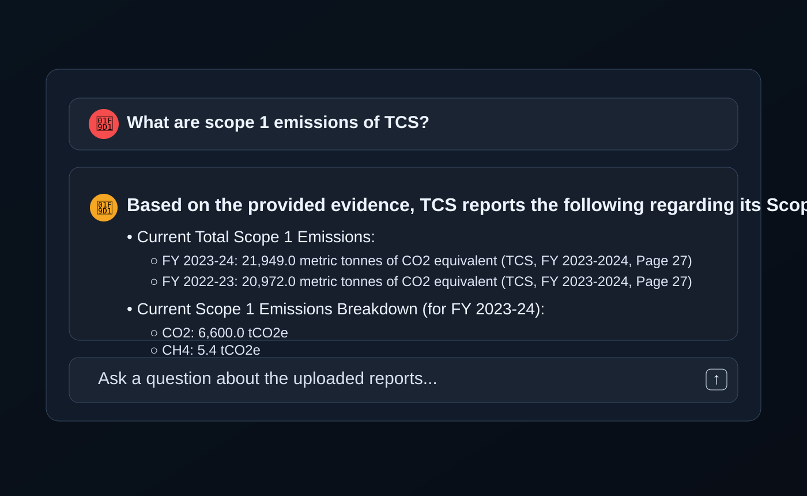
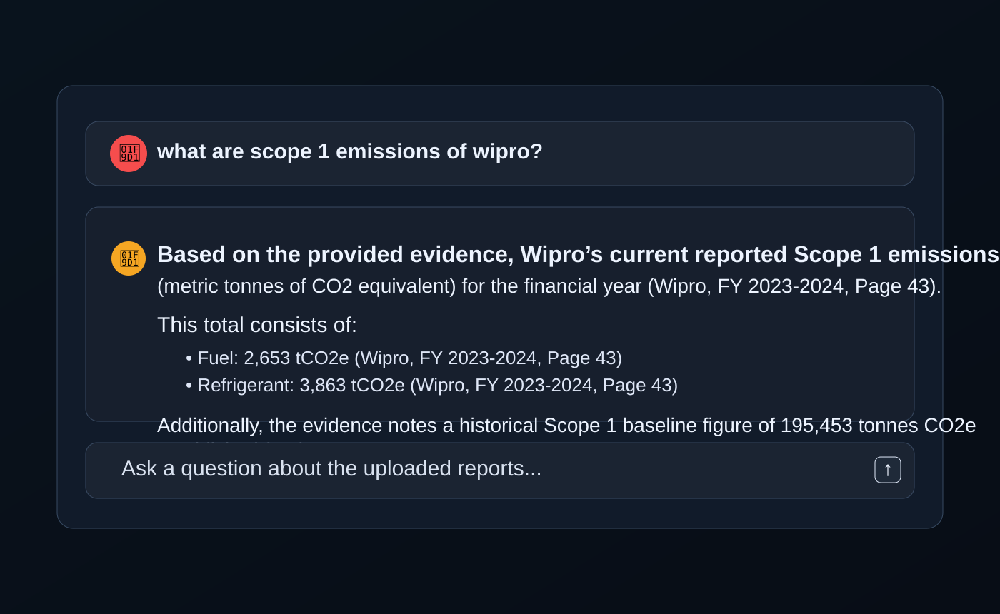
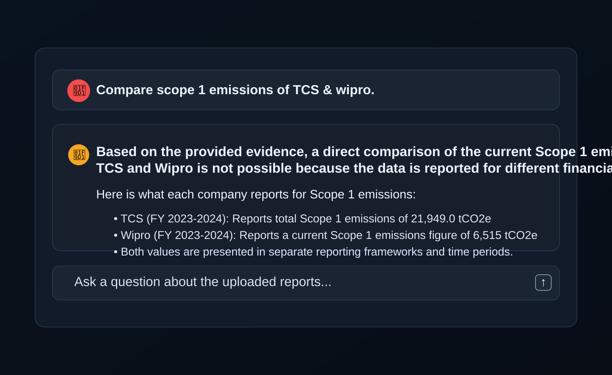

# Sustain AI — ESG Report Analysis Assistant

A Python-based AI assistant for analyzing corporate ESG and sustainability reports. The app lets users upload PDF reports, extract meaningful content, build a session-scoped retrieval index, and ask natural-language questions grounded in the uploaded documents.

This repository is designed for document-grounded Q&A over sustainability disclosures, with a focus on comparing and understanding ESG performance across uploaded company reports.

## What this project does

- Upload one or more ESG / sustainability PDF reports in a Streamlit session
- Extract text and tables from each PDF
- Chunk documents into smaller retrieval units
- Embed and store chunks in a vector database
- Retrieve the most relevant evidence for a user query
- Answer questions using an LLM while grounding responses in the uploaded report content
- Support follow-up questions within the same session

## High-level architecture

- `src/app.py` — Streamlit web interface
- `src/ingest.py` — PDF ingestion pipeline for uploaded files
- `src/extract1.py` — PDF text/table extraction logic
- `src/chunking.py` — chunking of extracted document content
- `src/embed_store.py` — sentence-transformer embeddings + ChromaDB storage
- `src/retrieve.py` — retrieval logic for relevant chunks
- `src/qa_engine.py` — question-answer orchestration and LLM prompting
- `src/answer.py` — answer formatting and evidence packaging
- `data/` — sample data, evaluation sets, extracted output, and uploaded PDFs

## Tech stack

- Python
- Streamlit
- pdfplumber
- SentenceTransformers
- ChromaDB
- Google Gemini API
- dotenv

## Repository structure

```text
.
├── .gitignore
├── data/
│   ├── chunks/
│   ├── eval_results.json
│   ├── eval_set.json
│   ├── extracted/
│   ├── pdfs/
│   └── uploaded_pdfs/
├── src/
│   ├── answer.py
│   ├── app.py
│   ├── chunking.py
│   ├── compare.py
│   ├── debug.py
│   ├── debug_retrieval.py
│   ├── embed_store.py
│   ├── evaluate.py
│   ├── extract1.py
│   ├── fix.py
│   ├── fix2.py
│   ├── fix3.py
│   ├── ingest.py
│   ├── qa_engine.py
│   ├── retrieve.py
│   └── test_retrieval.py
├── assets/
│   ├── 1.svg
│   ├── 2.svg
│   ├── 3.svg
│   └── 4.svg
└── README.md
```

## Features

### Session-scoped report analysis

Each chat session creates a fresh in-memory ChromaDB collection. This prevents cross-session contamination and allows users to upload and work with reports for a specific analysis task.

### PDF extraction and indexing

The pipeline reads uploaded PDF files, extracts text content and tables, and converts them into chunks that can later be retrieved semantically.

### Retrieval-augmented question answering

User questions are matched against indexed document chunks and the most relevant evidence is supplied to a Gemini model, allowing answers to be grounded in the uploaded ESG reports rather than generic knowledge.

### Company-aware retrieval

The application tracks company metadata and can filter by company when retrieving evidence, which helps when multiple reports are uploaded in the same session.

## Screenshots

### 1. Upload and session setup



### 2. Querying ESG metrics from uploaded reports



### 3. Scope 1 emissions answer example



### 4. Cross-company comparison workflow



## Setup

### 1. Clone the repository

```bash
git clone https://github.com/TanviJesmi-git/Sustain-AI---A-corporate-ESG-report-analysis-assistant.git
cd Sustain-AI---A-corporate-ESG-report-analysis-assistant
```

### 2. Create a virtual environment

```bash
python -m venv venv
source venv/bin/activate   # On macOS/Linux
# or
venv\Scripts\activate      # On Windows
```

### 3. Install dependencies

```bash
pip install -r requirements.txt
```

If a `requirements.txt` file is not present in your local clone, install the main packages manually:

```bash
pip install streamlit sentence-transformers chromadb pdfplumber python-dotenv google-genai
```

### 4. Configure environment variables

Create a `.env` file in the project root with your Gemini API key:

```env
GEMINI_API_KEY=your_api_key_here
```

## Run the app

From the project root:

```bash
streamlit run src/app.py
```

This launches the ESG Report Analysis Assistant in the browser. Upload sustainability reports from the sidebar, specify the company name and reporting year for each PDF, and begin asking questions.

## Example workflow

1. Upload one or more PDF ESG reports in the sidebar.
2. Enter the company name and reporting year.
3. Process each uploaded PDF.
4. Ask questions such as:
   - "What are the company’s emissions reduction targets?"
   - "How does the company report on water stewardship?"
   - "What governance risks were mentioned in the sustainability report?"
5. Review answers grounded in the uploaded report evidence.

## Notes

- The project currently uses a session-scoped in-memory ChromaDB collection.
- Answers are intended to be grounded in the reports uploaded for that session.
- If the uploaded content does not contain an answer, the app is designed to respond accordingly rather than fabricate unsupported claims.
- The repository includes evaluation scripts and sample JSON outputs under `data/` for benchmarking or experimentation.

## License

This project does not currently include a license file in the repository snapshot. If needed, add one before public distribution.

## Contributing

Contributions are welcome. You can:

- improve the extraction and chunking pipeline
- add better retrieval and reranking
- expand evaluation coverage
- improve the UI and prompting logic

## Contact

For questions or collaboration, please contact the repository owner or open an issue in the GitHub repository.
